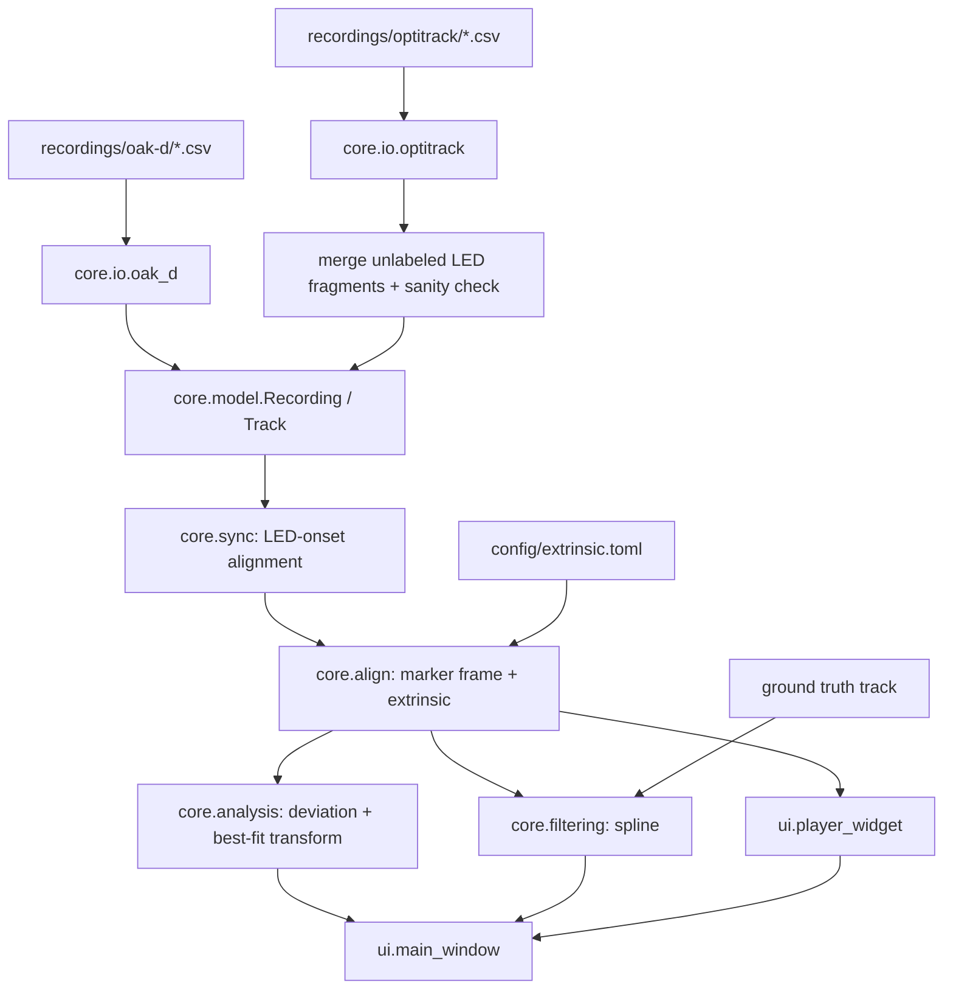

# Requirements

### Overview & Goals
Build a PySide6 desktop application that loads 3D infrared-LED tracking data from two camera systems (Luxonis Oak-D stereo camera and Optitrack), lets the user review it in a playback player, quantifies the deviation of an Oak-D recording against the Optitrack ground truth, and offers a spline-based smoothing filter.

The repository currently contains only `README.md`, `pyproject.toml` (no dependencies) and the `recordings/` sample data — everything is built from scratch.

### Scope
**In scope**
- CSV loaders for both formats (`recordings/oak-d/*.csv`, `recordings/optitrack/*.csv`).
- LED track reconstruction from Optitrack unlabeled marker columns.
- Time synchronization between the two systems.
- Reference-frame alignment using the three Oak-D markers and a configurable camera extrinsic.
- Analysis: per-axis and Euclidean deviation statistics, plus best-fit single transformation ("consistency of deviations").
- Spline filter with manual parameters and automatic optimization against ground truth.
- Player UI: play/pause, speed, timeline, multiple recordings at once, full-trajectory view.

**Out of scope**
- Live capture from either camera system.
- Writing back to the recording files (exports go to separate files).
- Automatic data-driven frame calibration (explicitly rejected in favour of a hand-specified extrinsic).

### User Stories
- As a researcher, I want to open one or several recordings and play them back with speed control, so I can visually inspect tracking behaviour.
- As a researcher, I want to see the whole trajectory as a static 3D curve, so I can judge overall shape and outliers.
- As a researcher, I want to load an Oak-D recording together with its Optitrack counterpart and get deviation statistics, so I can quantify the Oak-D accuracy.
- As a researcher, I want to know how much of the deviation is a systematic frame misalignment versus real noise, so I can separate calibration error from tracking error.
- As a researcher, I want to smooth a noisy Oak-D recording with a spline and either tune it by hand or have it auto-tuned against ground truth, so I can reduce triangulation noise.
- As a researcher, I want the filtered curve overlaid on the raw data in the player, so I can see what the filter did.

### Functional Requirements
**Data loading**
- Oak-D CSV: header `x,y,z,capture_time,detection_time,confidence`; one LED sample per row; `capture_time` is a monotonic absolute clock in seconds (~75 Hz in the samples). `confidence` is retained and exposed for optional thresholding.
- Optitrack CSV: 1-line key/value metadata row, then `Type` / `Name` / `ID` / measurement-type rows, then the `Frame,Time (Seconds),TimeCode,X,Y,Z,...` header row, then data. `Capture Frame Rate`, `Length Units` and `Capture Start Time` are parsed from the metadata row.
- The **first three XYZ column triplets** are the rigid-body markers mounted on the (stationary) Oak-D camera.
- **All remaining XYZ triplets are LED observations**; Optitrack starts a new triplet whenever tracking is lost and re-acquired. They are merged into a single trajectory: at most one of them is populated per frame; if several are populated the nearest-to-previous-position one is used and the conflict is reported.
- Sanity check on load: the three camera markers must be stationary (per-marker positional spread below a threshold) and the merged LED track must move (spread above a threshold). Violations surface as a clear warning listing the offending recording.
- Missing frames stay as gaps (NaN) and are never silently interpolated during loading.

**Time synchronization**
- The LED was switched on while both systems were already recording, so the **first valid LED sample in each recording is the same instant**. Each recording gets a normalized time axis `t = raw_time - t_first_led`.
- Recording pairing is offered by the leading name token in the filenames (`slow2`, `fast3`, `sweep`, …).
- The user can nudge the offset manually to correct for a mis-detected first sample.

**Reference-frame alignment**
- The extrinsic is the hand-measured position of each of the three tracking markers in the Oak-D camera space: origin at the optical center, seen from the camera `+x` right, `+y` up, `+z` forward. It lives in a configuration file and is editable in the UI.
- Because the markers form an irregular triangle, the first three Optitrack coordinate triplets are assigned to the measured markers automatically by comparing triangle side lengths — only one of the six arrangements fits. The rigid transform into the camera frame then follows from a Kabsch fit of the matched marker pairs.
- A recorded triangle that disagrees with the measured one, or one too regular to be matched unambiguously, is reported as a warning.
- Both datasets are converted to common units (centimeters; Optitrack `Length Units` is honoured).
- The fitted transform of each pair is cached per pair, since the camera may have been repositioned between takes.

**Analysis**
- Deviations are computed on a common time grid: ground truth is resampled to the analyzed recording's timestamps (linear interpolation, gaps excluded).
- Reported: mean and standard deviation of the signed difference per axis; mean and standard deviation of the Euclidean distance; RMSE, median and 95th percentile; sample count and excluded-sample count.
- "Consistency of deviations": the single best transformation applied to *all* points of the analyzed recording that minimizes deviation, with before/after statistics. Rigid, similarity, affine and full projective (homography-style 4×4) models are offered; the residual after fitting is the frame-independent tracking error.

**Filtering**
- A smoothing spline is fitted independently per axis over time; parameters: smoothing factor, spline degree, optional confidence weighting, optional resampling rate.
- Manual parameterization from the UI with live update.
- Automatic parameterization: scalar minimization of mean Euclidean deviation from a chosen ground-truth recording.
- The filtered result is a first-class recording that can be displayed alongside the original in the player and fed into the analysis.

**Player UI**
- 3D view with play/pause, speed selector, scrub timeline showing normalized time, and current-time readout.
- Several recordings visible simultaneously, colour-coded, with a legend and per-recording visibility toggles.
- Toggle between animated point (with optional trailing tail) and full static trajectory.

### Non-Functional Requirements
- Sample sizes are modest (≈2.7 k Oak-D rows, ≈8.6 k Optitrack frames); playback must stay smooth without downsampling by keeping per-frame work to index lookups on pre-built numpy arrays.
- The `sweep` recording has 13 LED column triplets and must load correctly.
- The core package must not import Qt, so it is unit-testable and usable from scripts.

# Technical Design

### Current Implementation
None. `pyproject.toml` declares `name = "point-tracking-filter"`, `requires-python = ">=3.12"` and empty `dependencies`; `uv.lock` has only the virtual root package. The only assets are `README.md` and the 19 CSV files in `recordings/`.

### Observed Data Formats
`recordings/oak-d/slow2_2026-08-04_15-28-00.csv` (2735 lines):
```
x,y,z,capture_time,detection_time,confidence
15.364299731391938,37.51184436372939,120.76405114358818,93684.489393,93684.520001,0.968958367496064
```

`recordings/optitrack/slow2 2026-08-04 03.25.39 PM.csv` (8629 lines):
```
Format Version,1.24,Take Name,...,Capture Frame Rate,120.000000,...,Length Units,Centimeters,Coordinate Space,Global
<blank>
,Type,,Marker,Marker,Marker,...
,Name,,Oak-D-Kamera:Marker 001,...,Unlabeled 1189,Unlabeled 1189,Unlabeled 1189
,ID,,"4CF0B31A...",...
,,,Position,Position,Position,...
Frame,Time (Seconds),TimeCode,X,Y,Z,X,Y,Z,X,Y,Z,X,Y,Z
0,0.000000,15:26:46:12.02,-92.003639,311.561951,134.137253,...,,,
```
The number of trailing unlabeled triplets varies per file: 1 (`slow2`), 2 (`slow5 2min`), 13 (`sweep`). The loader must therefore be column-count agnostic and drive everything off the `Name`/`Type` header rows plus the "first three triplets are the camera markers" rule.

### Key Decisions
1. **PySide6 desktop app** with `pyqtgraph.opengl` for the 3D views — smooth animation and a real timeline, unlike a browser-based option.
2. **Layered core + thin Qt UI**: `core/` is pure numpy/pandas/scipy and Qt-free; `ui/` only renders and wires signals.
3. **LED reconstruction by column-position convention**: triplets 1–3 are camera markers, all further triplets are LED fragments merged into one track, validated by a stationary-camera / moving-LED sanity check.
4. **Sync anchored on first LED appearance** in each recording, with a manual nudge as escape hatch.
5. **Frame alignment from hand-measured marker positions in camera space**, with the observed markers assigned to them by irregular-triangle side-length matching and a Kabsch fit — no data-driven fit of the trajectories. Residual misalignment is *measured* rather than hidden, by the separate "consistency of deviations" best-fit-transform analysis.
6. **Alignment cached per recording pair**, because the camera may have moved between takes.
7. **Smoothing spline per axis over time** (`scipy.interpolate.UnivariateSpline` / `make_smoothing_spline`), so gaps and non-uniform sampling are handled naturally and the smoothing factor is a single tunable scalar.

### Proposed Changes
**`core/model.py`** — the shared data structure everything else speaks:
```python
@dataclass
class Track:
    t: np.ndarray          # (N,) seconds, normalized to LED-on = 0
    xyz: np.ndarray        # (N, 3) centimeters, NaN where no observation
    confidence: np.ndarray | None
    name: str
    source: Literal["oak-d", "optitrack", "filtered"]
    meta: dict

@dataclass
class Recording:
    led: Track
    camera_markers: np.ndarray | None   # (3, 3) mean marker positions, Optitrack only
    path: Path
    frame_rate: float | None
```

**`core/io/oak_d.py`** — `load_oak_d(path) -> Recording`: `pandas.read_csv`, `capture_time` as the time base, `detection_time` kept in `meta`.

**`core/io/optitrack.py`** — `load_optitrack(path) -> Recording`:
- `parse_metadata(first_line) -> dict` for frame rate / units / capture start.
- Locate the `Frame,Time (Seconds),TimeCode` header row; read data with that row as header, disambiguating repeated `X/Y/Z` names by position.
- Group data columns into consecutive XYZ triplets; first three → `camera_markers`; remainder → LED candidate fragments.
- `merge_led_fragments(fragments) -> Track`: per frame take the single populated fragment; on multiple, pick the one nearest the previous valid position and record the conflict in `meta["merge_conflicts"]`.
- `validate_recording(rec)`: marker spread < `camera_motion_tol`, LED spread > `led_motion_min`; returns a list of warnings.

**`core/sync.py`** — `normalize_to_led_onset(track)` shifts time so the first non-NaN LED sample is `t=0`; `pair_recordings(oak_dir, opti_dir)` matches files by leading name token; `RecordingPair` carries an extra user `offset`.

**`core/align.py`** —
- `marker_frame(markers) -> (R, origin)`: origin = marker centroid, basis orthonormalized (Gram–Schmidt) from the marker triangle edges and their normal.
- `CameraExtrinsic` dataclass (translation, rotation, axis permutation/signs), loaded from `config/extrinsic.toml`, editable in the UI, identity by default.
- `to_camera_frame(track, markers, extrinsic) -> Track`.
- Per-pair results memoized in an `AlignmentCache`.

**`core/analysis.py`** —
- `resample_to(reference, times)` — linear per-axis interpolation with gap masking.
- `deviation_stats(track, ground_truth) -> DeviationStats` (per-axis mean/std, Euclidean mean/std/RMSE/median/p95, counts).
- `best_fit_transform(track, ground_truth, model)` for `"rigid" | "similarity" | "affine" | "projective"` — Kabsch/Umeyama for the first two, least squares for affine, DLT + `scipy.optimize.least_squares` refinement for projective.
- `consistency_report(pair, model) -> {before, after, transform}`.

**`core/filtering.py`** —
- `SplineParams(smoothing, degree, use_confidence_weights, resample_hz)`.
- `apply_spline_filter(track, params) -> Track` — per-axis smoothing spline over `t`, fitted per contiguous segment so gaps are not bridged.
- `optimize_spline(track, ground_truth, degree) -> SplineParams` — `scipy.optimize.minimize_scalar` on log-smoothing minimizing mean Euclidean deviation.

**`ui/`** —
- `main_window.py`: recording browser (scans `recordings/`), dock panels, warning banner for failed sanity checks.
- `player_widget.py`: `pyqtgraph.opengl.GLViewWidget`, `QTimer`-driven clock, play/pause, speed combo (0.25×–4×), `QSlider` timeline, animated-point-with-tail vs full-trajectory toggle, per-recording colour and visibility.
- `analysis_panel.py`: pair selection, transform-model selector, stats tables (before/after).
- `filter_panel.py`: spline controls with live preview and an "optimize against ground truth" button that adds the filtered `Track` to the player.

### File Structure
```
pyproject.toml                 (modified: add pyside6, pyqtgraph, numpy, pandas, scipy, pytest)
config/extrinsic.toml          (new)
src/point_tracking_filter/
  __init__.py                  (new)
  __main__.py                  (new: app entry point)
  core/
    model.py  io/oak_d.py  io/optitrack.py
    sync.py  align.py  analysis.py  filtering.py
  ui/
    main_window.py  player_widget.py  analysis_panel.py  filter_panel.py
tests/
  test_io_oak_d.py  test_io_optitrack.py  test_sync.py
  test_align.py  test_analysis.py  test_filtering.py
```

### Architecture Diagram


### Risks
- **Optitrack column layout assumptions.** The "first three triplets are camera markers" rule is a convention; the loader asserts it via the stationarity check and warns loudly instead of producing silently wrong results.
- **Multiple simultaneous LED fragments.** Reflections could populate two triplets in the same frame; nearest-neighbour continuity plus a reported conflict count keeps this visible.
- **Sparse-onset false trigger.** A single spurious sample before the real LED-on would break sync; onset detection requires a minimum run of consecutive valid samples and the offset stays user-adjustable.
- **Hand-specified extrinsic is approximate**, so absolute deviations will contain a systematic component. This is by design and quantified by the best-fit-transform analysis.
- **Projective fit instability** on nearly planar trajectories; the fit is regularized/normalized and falls back to affine with a warning if ill-conditioned.
- **`pyqtgraph.opengl` needs a working GL context**; a 2D multi-projection fallback view is provided if `GLViewWidget` fails to initialize.

# Testing

### Validation Approach
The Qt-free `core` package is covered by `pytest` unit tests run against the real files in `recordings/`, plus small synthetic fixtures where exact expected values are needed. The UI is validated by launching the app and exercising the player, analysis and filter panels manually via a smoke run.

### Key Scenarios
- Loading every file in `recordings/oak-d/` yields monotonic `capture_time`, finite XYZ, and confidence in `[0, 1]`.
- Loading every file in `recordings/optitrack/` succeeds regardless of column count, in particular `sweep 2026-08-04 04.11.10 PM.csv` (13 LED triplets) and `slow5 2min ...` (2 triplets).
- Optitrack metadata parsing returns `frame_rate == 120.0` and `Centimeters` for the sample files.
- For each Optitrack file the three camera markers are stationary and the merged LED track moves — the sanity check passes on all shipped recordings.
- Merged LED track has at most one observation per frame and its valid-sample count equals the union of the fragments' valid counts.
- LED-onset normalization puts the first valid LED sample at `t == 0` in both members of a pair.
- Marker frame construction returns an orthonormal rotation (`R @ R.T == I`, `det(R) == +1`).
- `deviation_stats` on a track compared to itself yields zero mean and zero std.
- `best_fit_transform` recovers a known synthetic transform for each model, and `consistency_report` never reports a worse post-fit mean deviation than the pre-fit one.
- Spline filtering of a synthetic noisy sine reduces RMSE against the clean signal; `optimize_spline` finds a smoothing value at least as good as the default.
- Pairing by filename token matches `slow2`, `fast3`, `sweep`, etc. across the two directories.

### Edge Cases
- Optitrack file with no unlabeled triplets at all → clear error, no crash.
- All-NaN LED track → onset detection and analysis raise an explicit, descriptive error.
- Two fragments populated in the same frame → conflict counted in `meta["merge_conflicts"]`, nearest-to-previous chosen.
- Non-overlapping time ranges after sync → analysis reports zero comparable samples instead of NaN statistics.
- Filtering a track with long gaps must not bridge them (segment-wise fit).
- Degenerate/collinear camera markers → frame construction raises rather than emitting a non-orthonormal basis.
- Nearly planar trajectory in the projective fit → falls back to affine with a warning.

### Test Changes
New test modules `tests/test_io_oak_d.py`, `tests/test_io_optitrack.py`, `tests/test_sync.py`, `tests/test_align.py`, `tests/test_analysis.py`, `tests/test_filtering.py`. UI code is not unit-tested; it is covered by the manual smoke run.

# Delivery Steps

### ✓ Step 1: Set up the package skeleton and data model
The project installs as a package with its dependencies declared and a shared `Track`/`Recording` model available.

- Add `pyside6`, `pyqtgraph`, `numpy`, `pandas`, `scipy` and a `pytest` dev group to `pyproject.toml`, with a src layout for `src/point_tracking_filter`.
- Create `core/model.py` with the `Track` dataclass (`t`, `xyz`, `confidence`, `name`, `source`, `meta`) and the `Recording` dataclass (`led`, `camera_markers`, `path`, `frame_rate`).
- Add helpers on `Track` for valid-sample masking, contiguous-segment iteration and positional spread.
- Add `__main__.py` as the future application entry point.

### ✓ Step 2: Implement the two CSV loaders with LED reconstruction
Both recording formats load into the common `Recording` model, with the Optitrack LED track reassembled from its unlabeled column sets.

- Implement `core/io/oak_d.py`: read `x,y,z,capture_time,detection_time,confidence`, use `capture_time` as the time base, keep `detection_time` in `meta`.
- Implement `core/io/optitrack.py`: parse the key/value metadata line (frame rate, length units, capture start), locate the `Frame,Time (Seconds),TimeCode` header row, and group data columns into positional XYZ triplets.
- Treat the first three triplets as the stationary Oak-D camera markers and all remaining triplets as LED fragments.
- Implement `merge_led_fragments`: one observation per frame, nearest-to-previous position when several fragments are populated, conflicts recorded in `meta`.
- Implement `validate_recording`: assert camera markers are stationary and the LED moves; return descriptive warnings.
- Add `tests/test_io_oak_d.py` and `tests/test_io_optitrack.py` covering all files in `recordings/`, including the 13-fragment `sweep` and 2-fragment `slow5 2min` cases.

### ✓ Step 3: Add time synchronization and reference-frame alignment
Paired Oak-D and Optitrack recordings share a common time axis and a common coordinate frame.

- Implement `core/sync.py`: `normalize_to_led_onset` (first run of consecutive valid LED samples becomes `t = 0`), filename-token based `pair_recordings`, and a `RecordingPair` carrying a user-adjustable offset.
- Implement `core/align.py`: `marker_frame` building an orthonormal basis and centroid origin from the three markers, raising on collinear markers.
- Add the `CameraExtrinsic` dataclass holding the three marker positions in camera space, loaded from a new `config/extrinsic.toml`, plus `match_markers`/`rigid_fit` deriving the global→camera transform from them.
- Implement `to_camera_frame` plus unit conversion to centimeters honouring the Optitrack `Length Units` field.
- Memoize the resulting transform per recording pair in an `AlignmentCache`.
- Add `tests/test_sync.py` and `tests/test_align.py` for onset normalization, pairing, and rotation orthonormality.

### ✓ Step 4: Implement deviation analysis and the best-fit transform
An Oak-D recording can be scored against its Optitrack ground truth, including how much of the error is a systematic transform.

- Implement `resample_to` in `core/analysis.py`: per-axis linear interpolation of the ground truth onto the analyzed timestamps with gap masking.
- Implement `deviation_stats`: per-axis signed mean/std, Euclidean mean/std/RMSE/median/p95, sample and exclusion counts.
- Implement `best_fit_transform` for rigid (Kabsch), similarity (Umeyama), affine (least squares) and projective (DLT plus `least_squares` refinement) models, with an affine fallback and warning on ill-conditioned planar data.
- Implement `consistency_report` returning before/after statistics and the fitted transform.
- Add `tests/test_analysis.py`: zero deviation against itself, recovery of known synthetic transforms, post-fit deviation never worse than pre-fit, and empty-overlap handling.

### ✓ Step 5: Implement the spline filter and its optimizer
Recordings can be smoothed with a spline whose parameters are either given or optimized against ground truth.

- Implement `SplineParams` (smoothing, degree, confidence weighting, resample rate) in `core/filtering.py`.
- Implement `apply_spline_filter`: per-axis smoothing spline over time fitted per contiguous segment so gaps are never bridged, returning a new `Track` with `source="filtered"`.
- Support optional confidence-based weighting for Oak-D data and optional uniform resampling.
- Implement `optimize_spline` using `minimize_scalar` over log smoothing to minimize mean Euclidean deviation from a ground-truth track.
- Add `tests/test_filtering.py`: RMSE reduction on a synthetic noisy sine, gaps preserved, and the optimizer beating the default smoothing.

### ✓ Step 6: Build the PySide6 player with multi-recording playback
A desktop window plays back one or several recordings in 3D with play/pause, speed and timeline controls.

- Implement `ui/player_widget.py` on `pyqtgraph.opengl.GLViewWidget` with a `QTimer`-driven playback clock, play/pause, a 0.25×–4× speed selector, a scrub timeline over normalized time and a current-time readout.
- Support several `Track`s at once with per-recording colour, legend and visibility toggles.
- Add a toggle between animated point with trailing tail and the full static trajectory.
- Implement `ui/main_window.py` with a recording browser scanning `recordings/`, dock layout, and a warning banner surfacing loader sanity-check failures.
- Add a 2D multi-projection fallback view if the OpenGL widget cannot initialize, and wire `__main__.py` to launch the window.

### ✓ Step 7: Wire the analysis and filter panels into the UI
Analysis results and filter tuning are driven from the UI and their output is visible in the player.

- Implement `ui/analysis_panel.py`: recording-pair selection, manual sync-offset nudge, transform-model selector, and before/after statistics tables from `consistency_report`.
- Implement `ui/filter_panel.py`: spline controls with live preview and an "optimize against ground truth" action calling `optimize_spline`.
- Add the filtered `Track` to the player as an additional overlay alongside the raw recording, and allow feeding it back into the analysis panel.
- Expose the camera extrinsic for editing and persist it to `config/extrinsic.toml`.
- Run the app against the sample recordings as a smoke check of playback, pairing, analysis and filtering.